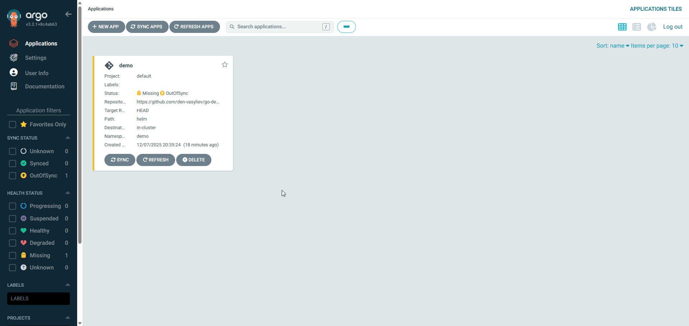

# AsciiArtify — MVP (Demo)

**Мета:** розгорнути MVP `go-demo-app` через ArgoCD і показати автоматичну синхронізацію з Git.

## Що включено
- ArgoCD Application manifest (`argocd-app.yaml`) для автоматичної синхронізації.
- GitHub Actions workflow для збірки і пушу Docker-образу (`.github/workflows/ci-build-push.yml`).

---

## Передумови
- Доступ до Kubernetes кластера (kubeconfig).
- ArgoCD встановлений у кластері (`argocd` namespace) та доступний.
- Облікові дані.

---

## Демонстрація автоматичної синхронізації

---
